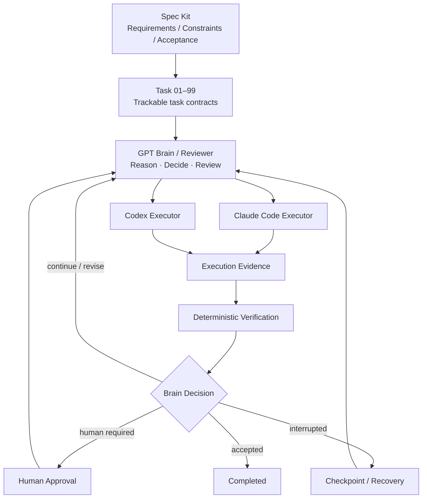

# NovaWing Development Guardian

> **Spec-driven AI software engineering orchestration.**  
> GPT acts as the Brain / Reviewer; Claude Code and Codex act as Executors. Specifications, task contracts, deterministic verification, human approval, and recovery mechanisms turn AI coding into a controlled engineering workflow.

**Status:** Active Development · **Core Repository:** Private · **This Repository:** Public Showcase

> [!IMPORTANT]
> This repository is intentionally a showcase rather than the source repository. Core implementation, complete prompts/protocols, internal control strategies, and details related to ongoing IP / patent planning remain private.

## What problem does NovaWing solve?

Coding agents are already capable of implementing features, editing repositories, and running tests. The harder problem appears when tasks become long-running and consequential:

- Who decides what the agent should do next?
- Who determines whether the result is actually complete?
- How are scope and permission boundaries enforced?
- What happens when verification fails?
- When should a human decision be required?
- How can an interrupted task resume from trusted progress?

NovaWing treats these as software-engineering problems rather than prompt-engineering tricks.

## Architecture



A useful mental model:

> **Spec Kit is the blueprint. Task 01–99 is the work-order system. GPT is the technical lead / reviewer. Claude Code and Codex are execution engineers. Guardian keeps the workflow bounded, verifiable, stoppable, and recoverable.**

## Core principles

1. **Spec before execution** — requirements, constraints, and acceptance criteria should be explicit before an agent starts changing code.
2. **Separate reasoning from execution** — the role deciding what to do should be distinct from the role performing repository operations.
3. **Evidence over claims** — an Executor saying “done” is not sufficient proof of completion.
4. **Deterministic verification** — use tests, type checks, builds, linting, and task-specific checks whenever possible.
5. **Hard scope boundaries** — allowed paths, forbidden paths, and task constraints are execution boundaries, not suggestions.
6. **Human control at critical decisions** — automation should be able to stop safely and request approval.
7. **Recover instead of restart** — interrupted long-running tasks should resume from validated checkpoints where possible.

## Workflow

```text
Specification
→ Task Contract
→ Brain Decision
→ Executor
→ Execution Evidence
→ Deterministic Verification
→ Brain Review
→ Human Approval / Recovery when needed
→ Accepted Task
```

## Why not just use a coding agent directly?

For small tasks, directly using Claude Code or Codex is often the simplest and best choice.

NovaWing targets a different problem: **reliably coordinating complex, multi-step engineering tasks under explicit constraints**.

The value is not “more agents.” The value is a durable control chain:

> **Specification → Decision → Execution → Evidence → Verification → Human Control → Recovery**

## Public / private boundary

This repository may contain:

- high-level architecture;
- workflow and design rationale;
- sanitized screenshots and demos;
- non-sensitive task examples;
- public technical notes.

The following remain private by default:

- core source code;
- complete system / reviewer prompts;
- internal Executor adapters;
- detailed approval, recovery, and security protocols;
- unpublished IP / patent-related implementation details.

See [`docs/disclosure.md`](docs/disclosure.md) for the disclosure policy.

## Documentation

- [`Architecture`](docs/architecture.md)
- [`Workflow`](docs/workflow.md)
- [`Design Principles`](docs/design-principles.md)
- [`Demo & Evidence`](docs/demo.md)
- [`Technical FAQ`](docs/faq.md)
- [`Public Disclosure Boundary`](docs/disclosure.md)

---

NovaWing Development Guardian is independently designed and developed. Core implementation remains private.
