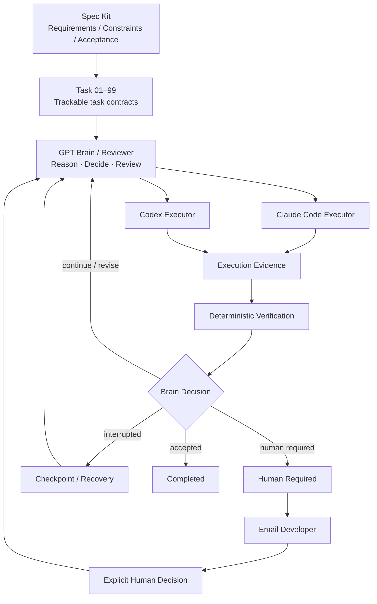

# NovaWing Development Guardian

[中文](README.md)

> **Spec-driven AI software engineering orchestration.**  
> GPT acts as the Brain / Reviewer; Claude Code and Codex act as Executors. Specifications, task contracts, deterministic verification, human approval, email notification, and recovery mechanisms turn AI coding into a controlled engineering workflow.

**Status:** Active Development · **Core Repository:** Private · **This Repository:** Public Showcase

> [!IMPORTANT]
> This repository is intentionally a showcase rather than the source repository. Core implementation, complete prompts/protocols, internal control strategies, and details related to ongoing IP / patent planning remain private.

## Real runtime evidence


The Launchpad manages persisted, recoverable Work Sessions and exposes the configured reviewer, executor, Git strategy, and email-notification state.


A running Work Session keeps the task, current phase, activity feed, and execution log visible. Executor work is followed by an independent review phase rather than being accepted solely because the Executor reports `done`.


When Brain transport becomes temporarily unavailable, the session can enter an explicit degraded state while preserving a checkpoint, then resume from trusted progress instead of discarding completed Executor work.

See the full five-screen walkthrough in [`Demo & Evidence`](docs/demo.md).

## Start here

For a fast technical review:

1. [`Demo & Evidence`](docs/demo.md) — real runtime screenshots and the product-level workflow.
2. [`Brain / Executor`](docs/brain-executor.md) — why reasoning and repository execution are separated.
3. [`Spec-driven Development`](docs/spec-driven-development.md) — how requirements become executable specifications.
4. [`Task Contract`](docs/task-contract.md) — why Task 01–99 is more than a todo list.
5. [`Verification & Recovery`](docs/verification-recovery.md) — how completion is verified and interrupted work resumes.
6. [`Implementation Status`](docs/implementation-status.md) — what is implemented, evolving, or still planned.
7. [`Technical Review Guide`](docs/technical-review-guide.md) — a practical evaluation path for technical reviewers.

> Most detailed documents are currently written in Chinese; diagrams and system terminology remain intentionally language-neutral.

## What problem does NovaWing solve?

Coding agents are already capable of implementing features, editing repositories, and running tests. The harder problem appears when tasks become long-running and consequential:

- Who decides what the agent should do next?
- Who determines whether the result is actually complete?
- How are scope and permission boundaries enforced?
- What happens when verification fails?
- When should a human decision be required?
- How is the developer notified without continuously watching the session?
- How can an interrupted task resume from trusted progress?

NovaWing treats these as software-engineering problems rather than prompt-engineering tricks.

## Architecture



A useful mental model:

> **Spec Kit is the blueprint. Task 01–99 is the work-order system. GPT is the technical lead / reviewer. Claude Code and Codex are execution engineers. Guardian keeps the workflow bounded, verifiable, stoppable, notifyable, and recoverable.**

## Human-in-the-loop without constant supervision

When a task reaches a state that requires explicit human judgment — approval / rejection, manual continuation, a high-risk action, or a decision that cannot be automated safely — NovaWing can:

```text
Human Required
→ Persist Session / Checkpoint
→ Suspend Automation
→ Email Developer
→ Explicit Human Decision
→ Resume Existing Session
→ Verification / Review
```

Email is an **attention-routing mechanism, not an authorization mechanism**. A human continuation does not automatically change the original Goal, Constraints, Acceptance Criteria, Allowed Paths, or Forbidden Paths.

## Core principles

1. **Spec before execution** — requirements, constraints, and acceptance criteria should be explicit before an agent starts changing code.
2. **Separate reasoning from execution** — the role deciding what to do should be distinct from the role performing repository operations.
3. **Evidence over claims** — an Executor saying “done” is not sufficient proof of completion.
4. **Deterministic verification** — use tests, type checks, builds, linting, and task-specific checks whenever possible.
5. **Hard scope boundaries** — allowed paths, forbidden paths, and task constraints are execution boundaries, not suggestions.
6. **Human control at critical decisions** — automation should stop safely, preserve progress, and notify a developer when explicit judgment is needed.
7. **Recover instead of restart** — interrupted long-running tasks should resume from validated checkpoints where possible.

## Why not just use a coding agent directly?

For small tasks, directly using Claude Code or Codex is often the simplest and best choice.

NovaWing targets a different problem: **reliably coordinating complex, multi-step engineering tasks under explicit constraints**.

The value is not “more agents.” The value is a durable control chain:

> **Specification → Decision → Execution → Evidence → Verification → Human Control → Notification → Recovery**

## Public / private boundary

This repository may contain high-level architecture, workflow rationale, sanitized runtime screenshots, task examples, and public technical notes. Core source, complete prompts/protocols, internal Executor adapters, detailed approval/recovery/security implementation, and unpublished IP/patent-related details remain private by default.

See [`docs/disclosure.md`](docs/disclosure.md) for the disclosure policy.

## Documentation

- [`Demo & Evidence`](docs/demo.md)
- [`Architecture`](docs/architecture.md)
- [`Brain / Executor`](docs/brain-executor.md)
- [`Spec-driven Development`](docs/spec-driven-development.md)
- [`Task Contract`](docs/task-contract.md)
- [`Workflow`](docs/workflow.md)
- [`Verification & Recovery`](docs/verification-recovery.md)
- [`Design Principles`](docs/design-principles.md)
- [`Implementation Status`](docs/implementation-status.md)
- [`Technical Review Guide`](docs/technical-review-guide.md)
- [`Public Roadmap`](docs/roadmap.md)
- [`Technical FAQ`](docs/faq.md)
- [`Public Disclosure Boundary`](docs/disclosure.md)

---

NovaWing Development Guardian is independently designed and developed. Core implementation remains private.
