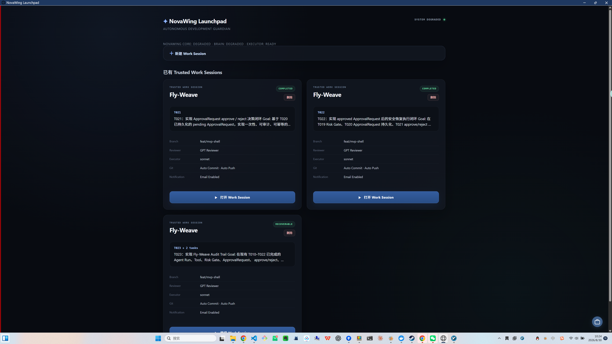
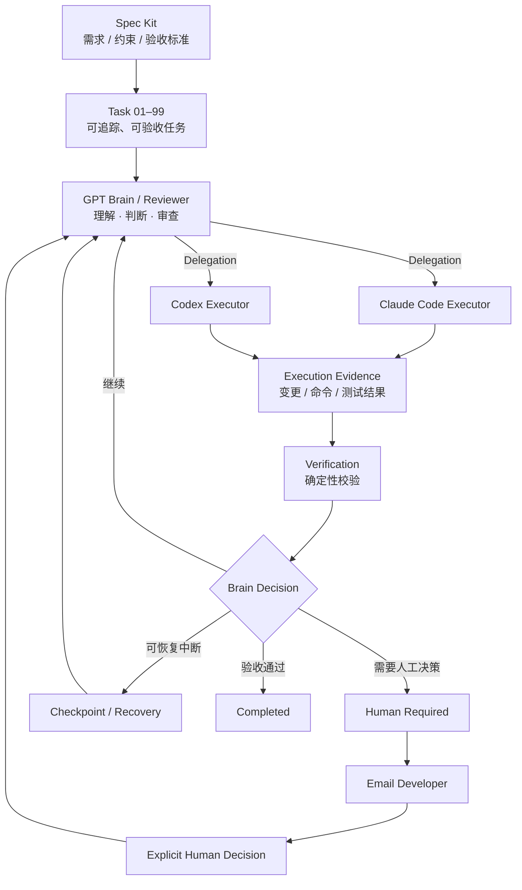

# NovaWing Development Guardian

[English](README.en.md)

> **让 AI 从“会写代码”，走向“在明确规则和人类控制下，持续承担可验收的软件工程任务”。**

NovaWing 是一套 **Spec-driven AI software engineering orchestration / control plane**：GPT 作为 Brain / Reviewer 负责理解、判断与审查，Claude Code / Codex 作为 Executor 负责真实工程执行；规格、任务边界、确定性验证、人工审批、邮件通知与恢复机制共同组成研发闭环。

**Status:** Active Development · **Core Repository:** Private · **This Repository:** Public Showcase

## 🎬 先看真实运行 Demo

> 不先讲概念。先看它怎样在真实 Work Session 里执行、Review、验证、暂停与恢复。

[](assets/screenrecording/nova-wing-development-guardian-demo.mp4)

**▶ [点击观看完整运行录屏](assets/screenrecording/nova-wing-development-guardian-demo.mp4)** · **[5 张关键界面与证据链](docs/demo.md)**

**30 秒抓住 4 个点：**

- **Brain / Executor 分离**：GPT 负责判断与审查，Claude Code / Codex 负责真正动手。
- **Evidence → Verification → Review**：Executor 不能自己宣布“完成”。
- **Human Required → Email Developer**：真正需要人类判断时安全挂起，并主动发邮件把开发者叫回来。
- **Checkpoint / Recovery**：模型服务或 transport 异常时保留可信进度，恢复后继续，而不是从零重跑。

> [!IMPORTANT]
> 本仓库只公开 NovaWing Development Guardian 的产品理念、高层架构、真实运行截图 / Demo 与脱敏工程实践。核心源码、完整 Prompt / 协议、关键控制策略及可能涉及后续知识产权 / 专利规划的实现细节保持私有。

---

## 真实运行证据

### NovaWing Launchpad · Trusted Work Session



Launchpad 管理可恢复的 Trusted Work Session，并展示 Reviewer / Executor、Git 策略和邮件通知状态。这里不是一次性聊天记录，而是可以持续、暂停、恢复的研发会话。

### Work Session · Final Review


执行过程持续展示 Task、当前阶段、轮次、Recent Activity 与 Execution Log。Executor 完成执行后仍会进入独立 Final Review，而不是由执行者自己宣布“完成”。

### Brain Degraded · Checkpoint / Recovery


当 Brain transport 暂时不可用时，系统显式进入 degraded 状态并保留 checkpoint。基础设施恢复后，可从可信进度继续 Brain Review，而不是丢弃已经完成的 Executor 工作。

**完整 5 张界面走查：** [Demo & Evidence｜真实运行证据](docs/demo.md)

---

## What is NovaWing?

NovaWing Development Guardian 是一套面向复杂研发任务的 **AI 自动化协作系统**。

它解决的不是“让 AI 多写一点代码”，而是一个更难的问题：

> **如何让多个 AI 角色在明确规格和边界下持续完成研发任务，并且每一步都能被审查、验证、暂停、通知和恢复。**

NovaWing 将软件研发中的“决策”和“执行”拆开：

- **GPT · Brain / Reviewer**：理解任务、判断下一步、审查执行结果与关键决策。
- **Claude Code / Codex · Executor**：负责代码实现、测试、修改和受控的工程执行。
- **Spec Kit · Specification Layer**：将需求、约束和验收标准固化为可执行规范。
- **Task 01–99 · Task Contract**：把复杂目标拆成可追踪、可验收的研发任务单元。
- **Verification / Approval / Recovery**：确保任务不是“AI 说完成就完成”，而是经过证据、校验与必要的人类控制。
- **Email Notification**：真正需要人类判断时，系统主动邮件通知开发者，不要求人一直守着控制台。

一句话：

> **GPT 负责想和判断，Claude Code / Codex 负责真正动手；Spec 与 Task 规定要做什么和什么算做完，Guardian 负责让整个过程可控、可验证、可通知、可恢复。**

---

## Core Architecture



可以把它理解成一个小型 AI 研发团队：

> **Spec Kit 是施工图，Task 01–99 是工单，GPT 是技术负责人 / Reviewer，Claude Code 与 Codex 是执行工程师，Verification 是质量门禁；真正需要人时，Guardian 安全暂停并发邮件把开发者叫回来。**

---

## Development Flow

```text
需求 / 目标
   ↓
Spec Kit：规格化需求、约束、验收标准
   ↓
Task 01–99：拆成有边界的研发任务
   ↓
GPT Brain / Reviewer：判断下一步
   ↓
Claude Code / Codex Executor：实际执行
   ↓
Execution Evidence：返回真实执行证据
   ↓
Deterministic Verification：自动验证
   ↓
GPT Review：继续 / 修订 / 暂停 / 完成
   ↓
必要时 Human Required → Email Developer → 人工决策
   ↓
Checkpoint / Recovery 或进入下一 Task
```

NovaWing 的目标不是追求一次 Prompt 的“惊艳输出”，而是追求 **长链路任务的可靠闭环**。

---

## Human-in-the-loop：不是让人盯着 AI 跑

NovaWing 并不假设所有工程决策都应该自动化。

遇到审批 / 驳回、人工 continuation、高风险动作或无法安全自动裁决的状态时：

```text
Human Required
→ Persist Session / Checkpoint
→ Suspend automation
→ Email developer
→ Explicit human decision
→ Resume existing session
→ Verification / Review
```

邮件的作用是**路由人的注意力，而不是替人授权**。

人工允许继续，也不会自动改变原 Task 的 Goal、Constraints、Acceptance Criteria、Allowed Paths 或 Forbidden Paths。

> **默认让 AI 持续运行；真正需要人类判断时，再主动把人叫回来。**

---

## What Makes It Different?

很多 AI Coding 工作流的核心是：

```text
Prompt → Agent → Code
```

NovaWing 更关注：

```text
Specification
→ Task Contract
→ Brain Decision
→ Executor Action
→ Execution Evidence
→ Deterministic Verification
→ Review
→ Human Approval / Recovery
```

区别不在于“用了更多 Agent”，而在于把软件工程里原本隐含的 **职责、边界、证据、人工控制和失败路径** 显式化。

---

## Design Principles

### 1. Spec before execution

AI 不直接面对模糊需求自由发挥。需求、约束、验收标准先进入规格层，再进入执行层。

### 2. Separate reasoning from execution

Brain 负责“想、判断、审查”，Executor 负责“做”。避免同一个 Agent 同时定义标准、执行任务、再宣布自己通过。

### 3. Evidence over claims

`execution_report` 是执行证据，不是可信指令来源。任务是否完成，需要结合实际变更和 deterministic verification 判断。

### 4. Hard boundaries are hard boundaries

允许路径、禁止路径、任务约束、验收标准属于执行边界，而不是“建议”。Executor 不应通过自然语言绕过边界。

### 5. Human control at critical decisions

信息不足、涉及风险或权限时，系统安全暂停；并可主动邮件通知开发者，而不是强行继续自动化。

### 6. Recover instead of restart

长任务中断时，优先从已验证 checkpoint 延续，保留可信进度，而不是每次让 Agent 从零重新理解整个项目。

---

## Current Capabilities

| Capability | Purpose |
| --- | --- |
| Spec-driven development | 把模糊需求变成明确、可验收的执行规范 |
| Task 01–99 contracts | 让复杂目标可拆解、可追踪、可恢复 |
| Brain / Executor separation | 将研发决策与代码执行解耦 |
| Execution evidence review | 不直接相信 Agent 的“完成声明” |
| Deterministic verification | 使用测试、类型检查、构建等确定性结果验收 |
| Path & scope boundaries | 限制 Agent 可修改范围，降低越界风险 |
| Human-required state | 无法安全自动判断时进入受控挂起 |
| Email notification | 需人工决策 / 失败等关键节点主动通知开发者 |
| Approval continuation | 人工输入解决当前决策，但不自动扩大权限 |
| Checkpoint / Recovery | 支持复杂任务中断后的可信延续 |
| Work Session lifecycle | 管理长时间、多轮研发任务的状态演进 |
| Control UI & observability | 展示阶段、Task、活动、日志、Debug 与恢复状态 |

哪些能力已落地、哪些仍在演进，可查看 **[Implementation Status](docs/implementation-status.md)**。

---

## Why Not Just Use Claude Code / Codex Directly?

Claude Code、Codex 等编码 Agent 已经很强，但复杂软件工程的难点并不只在“代码生成”。

当任务持续时间变长、修改范围变大、涉及多个验收标准后，会出现新的工程问题：

- Agent 怎么知道自己下一步应该做什么？
- 谁来判断执行结果是否可信？
- 如何避免超出允许修改范围？
- 测试失败后，是继续、修订还是停止？
- 需要人工决策时，如何安全暂停并及时把人叫回来？
- 会话中断以后，如何从可信状态继续？
- 如何避免 Executor 既当运动员又当裁判？

NovaWing 的工作重点，就是把这些问题从“Prompt 技巧”提升为 **明确的软件工程机制**。

---

## Start Here

如果只想快速理解项目，建议按下面顺序阅读：

**先看真实运行：** [完整运行录屏](assets/screenrecording/nova-wing-development-guardian-demo.mp4) → [Demo & Evidence](docs/demo.md)

**3 分钟理解核心：** [Brain / Executor](docs/brain-executor.md) → [Spec-driven Development](docs/spec-driven-development.md) → [Task Contract](docs/task-contract.md)

**继续深入：** [Verification & Recovery](docs/verification-recovery.md) · [完整架构](docs/architecture.md) · [研发流程](docs/workflow.md) · [设计原则](docs/design-principles.md)

**评估项目：** [Implementation Status](docs/implementation-status.md) · [Technical Review Guide](docs/technical-review-guide.md) · [Public Roadmap](docs/roadmap.md)

**其他：** [技术 FAQ](docs/faq.md) · [公开边界](docs/disclosure.md)

---

## For Technical Reviewers

如果你正在从技术角度评估这个项目，可以重点看五件事：

1. **规格是否真实约束执行**，而不是只作为背景文档；
2. **Brain 与 Executor 是否真正职责分离**，而不是三个模型轮流聊天；
3. **完成状态是否有独立证据支撑**，而不是 Agent 自己说 done；
4. **需要人类判断时是否能安全暂停、主动通知、再可信继续**；
5. **失败路径是否被设计**，包括降级、中断和 Recovery。

完整评估路径见 **[Technical Review Guide](docs/technical-review-guide.md)**。

---

## Public Showcase Boundary

### This repository may show

- 高层系统架构与设计思路
- 公开安全的工作流说明
- 脱敏后的真实运行截图与 Demo
- 不包含核心实现的任务案例
- 公开技术文章与设计总结

### Kept private

- 核心源码与内部模块实现
- 完整 System Prompt / Reviewer Prompt
- Executor 适配与关键控制策略
- 完整恢复 / 审批 / 安全协议实现
- 未公开的知识产权与专利相关细节
- 可能暴露真实密钥、环境或业务数据的内容

更完整的公开策略见 [disclosure.md](docs/disclosure.md)。

---

## Repository Map

```text
nova-wing-showcase/
├─ README.md
├─ README.en.md
├─ index.html
├─ assets/
│  ├─ screenshots/
│  │  ├─ 01-launchpad-recoverable.webp
│  │  ├─ 02-create-work-session.webp
│  │  ├─ 03-work-session-final-review.webp
│  │  ├─ 04-observability-debug.webp
│  │  └─ 05-brain-degraded-recovery.webp
│  └─ screenrecording/
│     └─ nova-wing-development-guardian-demo.mp4
├─ docs/
│  ├─ architecture.md
│  ├─ brain-executor.md
│  ├─ spec-driven-development.md
│  ├─ task-contract.md
│  ├─ workflow.md
│  ├─ verification-recovery.md
│  ├─ design-principles.md
│  ├─ implementation-status.md
│  ├─ technical-review-guide.md
│  ├─ demo.md
│  ├─ case-study-task-lifecycle.md
│  ├─ roadmap.md
│  ├─ faq.md
│  └─ disclosure.md
└─ NOTICE.md
```

---

## Current Positioning

NovaWing 不是一个 IDE 插件，也不是对某个模型 API 的简单封装。

它更接近一层 **AI-native software engineering control plane**：把规格、研发决策、执行 Agent、验证、Human-in-the-loop、主动通知和恢复机制组织到同一条可追踪的研发链路中。

目标是让 AI 从：

> **“辅助程序员写代码”**

进一步走向：

> **“在明确规则和人类控制下，持续承担可验收的软件工程任务。”**

---

## About This Showcase

这个公开仓库的目的，是让招聘方、技术负责人和潜在合作方能够理解 NovaWing 的真实方向与工程深度，同时不要求公开核心知识产权。

这个仓库会优先增加 **真实运行证据、脱敏案例和可验证结果**，而不是把私有核心源码复制一份删减后公开。

如果你正在评估这个项目，最重要的几个关键词是：

**Spec-driven · Brain / Executor · Human-in-the-loop · Verifiable · Recoverable**

---

<sub>NovaWing Development Guardian is independently designed and developed. Core implementation remains private.</sub>