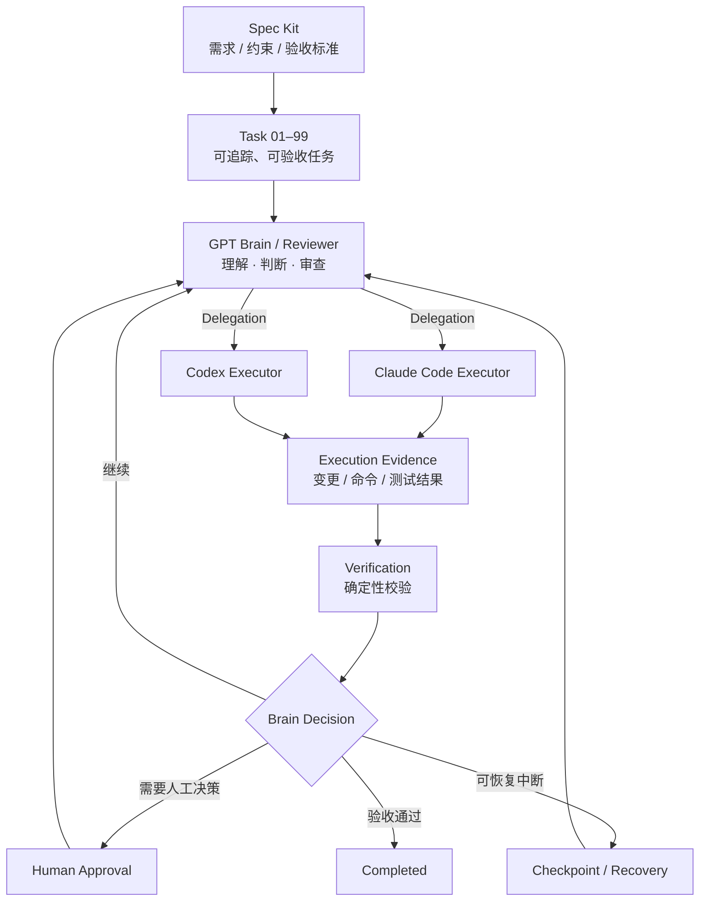

# NovaWing Development Guardian

> **Spec-driven AI software engineering orchestration**  
> 让 GPT 负责“理解、判断与审查”，让 Claude Code / Codex 负责“执行”，并通过规格、任务边界、验证、审批与恢复机制，把 AI 编码纳入可控制、可验证、可持续执行的研发闭环。

**Status:** Active Development · **Core Repository:** Private · **This Repository:** Public Showcase

> [!IMPORTANT]
> 本仓库仅用于公开展示 NovaWing Development Guardian 的产品理念、系统架构与脱敏后的工程实践。核心源码、完整 Prompt / 协议、关键执行策略及可能涉及后续知识产权 / 专利规划的实现细节保持私有。

---

## What is NovaWing?

NovaWing Development Guardian 是一套面向复杂研发任务的 **AI 自动化协作系统**。

它解决的不是“让 AI 多写一点代码”，而是一个更难的问题：

> **如何让多个 AI 角色在明确规格和边界下持续完成研发任务，并且每一步都能被审查、验证、暂停和恢复。**

NovaWing 将软件研发中的“决策”和“执行”拆开：

- **GPT · Brain / Reviewer**：理解任务、判断下一步、审查执行结果与关键决策。
- **Claude Code / Codex · Executor**：负责代码实现、测试、修改和受控的工程执行。
- **Spec Kit · Specification Layer**：将需求、约束和验收标准固化为可执行规范。
- **Task 01–99 · Task Contract**：把复杂目标拆成可追踪、可验收的研发任务单元。
- **Verification / Approval / Recovery**：确保任务不是“AI 说完成就完成”，而是经过证据、校验与必要的人类控制。

---

## Core Architecture



一句话理解：

> **Spec Kit 是施工图，Task 01–99 是工单，GPT 是技术负责人 / Reviewer，Claude Code 与 Codex 是执行工程师，Guardian 则负责让整个过程不越界、不失控、不靠“自报完成”。**

---

## Development Flow

```text
需求 / 目标
   ↓
Spec Kit：规格化需求、约束、验收标准
   ↓
Task 01–99：拆成有边界的研发任务
   ↓
GPT Brain / Reviewer：判断下一步
   ↓
Claude Code / Codex Executor：实际执行
   ↓
Execution Evidence：返回真实执行证据
   ↓
Deterministic Verification：自动验证
   ↓
GPT Review：继续 / 修订 / 暂停 / 完成
   ↓
必要时 Human Approval 或 Checkpoint / Recovery
```

NovaWing 的目标不是追求一次 Prompt 的“惊艳输出”，而是追求 **长链路任务的可靠闭环**。

---

## Design Principles

### 1. Spec before execution

AI 不直接面对模糊需求自由发挥。需求、约束、验收标准先进入规格层，再进入执行层。

### 2. Separate reasoning from execution

Brain 负责“想、判断、审查”，Executor 负责“做”。避免同一个 Agent 同时定义标准、执行任务、再宣布自己通过。

### 3. Evidence over claims

`execution_report` 只作为执行证据，而不是可信指令来源。任务是否完成，需要结合实际变更和 deterministic verification 判断。

### 4. Hard boundaries are hard boundaries

允许路径、禁止路径、任务约束、验收标准属于执行边界，而不是“建议”。Executor 不应通过自然语言绕过边界。

### 5. Human control at critical decisions

涉及风险、权限或无法自动裁决的关键节点时，系统进入人工审批 / 挂起状态，而不是强行继续。

### 6. Recover instead of restart

长任务发生中断时，优先从已验证 checkpoint 延续，保留可信进度，而不是每次都让 Agent 从零重新理解整个项目。

---

## What NovaWing Focuses On

| Capability | Purpose |
| --- | --- |
| Spec-driven development | 把模糊需求变成明确、可验收的执行规范 |
| Task 01–99 contracts | 让复杂目标可拆解、可追踪、可恢复 |
| Brain / Executor separation | 将研发决策与代码执行解耦 |
| Execution evidence review | 不直接相信 Agent 的“完成声明” |
| Deterministic verification | 使用测试、类型检查、构建等确定性结果验收 |
| Path & scope boundaries | 限制 Agent 可修改范围，降低越界风险 |
| Human approval | 在关键决策点保留人的最终控制权 |
| Checkpoint / Recovery | 支持复杂任务中断后的可信延续 |
| Work session lifecycle | 管理长时间、多轮研发任务的状态演进 |

---

## Why Not Just Use Claude Code / Codex Directly?

Claude Code、Codex 等编码 Agent 已经非常强，但复杂软件工程的难点并不只在“代码生成”。

当任务持续时间变长、修改范围变大、涉及多个验收标准后，会出现新的工程问题：

- Agent 怎么知道自己下一步应该做什么？
- 谁来判断它的执行结果是否可信？
- 如何避免超出允许修改范围？
- 测试失败后，是继续、修订还是停止？
- 需要人工决策时，如何安全暂停？
- 会话中断以后，如何从可信状态继续？
- 如何避免 Executor 既当运动员又当裁判？

NovaWing 的工作重点，就是把这些问题从“Prompt 技巧”提升为 **明确的软件工程机制**。

---

## Public Showcase Boundary

### This repository may show

- 高层系统架构与设计思路
- 公开安全的工作流说明
- 脱敏后的运行截图与 Demo
- 不包含核心实现的任务案例
- 公开技术文章与设计总结

### Kept private

- 核心源码与内部模块实现
- 完整 System Prompt / Reviewer Prompt
- Executor 适配与关键控制策略
- 完整恢复 / 审批 / 安全协议实现
- 未公开的知识产权与专利相关细节
- 可能暴露真实项目路径、密钥、环境或业务数据的内容

---

## Repository Map

```text
nova-wing-showcase/
├─ README.md
├─ docs/
│  ├─ architecture.md       # 架构与角色边界
│  ├─ workflow.md           # 从 Spec 到执行闭环
│  ├─ design-principles.md  # 核心设计原则
│  ├─ demo.md               # Demo / 截图展示位
│  └─ disclosure.md         # 公开边界说明
└─ NOTICE.md
```

---

## Current Positioning

NovaWing 不是一个 IDE 插件，也不是对某个模型 API 的简单封装。

它更接近一层 **AI-native software engineering control plane**：把规格、研发决策、执行 Agent、验证、人类审批和恢复机制组织到同一条可追踪的研发链路中。

目标是让 AI 从：

> **“辅助程序员写代码”**

进一步走向：

> **“在明确规则和人类控制下，持续承担可验收的软件工程任务。”**

---

## About This Showcase

这个公开仓库的目的，是让招聘方、技术负责人和潜在合作方能够理解 NovaWing 的真实方向与工程深度，同时不要求公开核心知识产权。

如果你正在评估这个项目，最重要的三个关键词是：

**Spec-driven · Brain / Executor · Verifiable & Recoverable**

---

<sub>NovaWing Development Guardian is independently designed and developed. Core implementation remains private.</sub>
