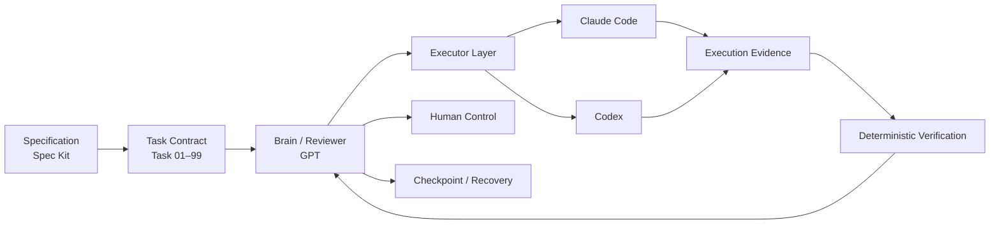
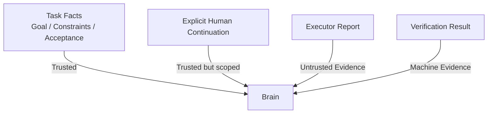

# Architecture

NovaWing Development Guardian 的核心思想不是“多模型一起写代码”，而是把软件研发拆成几个职责明确、彼此制衡的角色。

## 1. Responsibility model



### Specification Layer

负责回答：

- 要解决什么问题？
- 哪些约束不能突破？
- 什么结果才算完成？
- 哪些行为明确禁止？

NovaWing 不希望 Executor 通过“猜需求”工作，因此在执行前尽可能将目标转化为结构化、可验收的任务事实。

### Task Contract Layer

复杂需求通过约定的 `Task 01–99` 体系拆解为连续研发单元。

每个任务的价值不在编号本身，而在于它形成了一份稳定的执行契约：

```text
Goal
Constraints
Acceptance Criteria
Allowed Scope
Forbidden Scope
Do Not Do
Verification
```

任务可以被执行、审查、挂起、恢复和验收，而不是只存在于一次聊天上下文中。

### Brain / Reviewer

GPT 作为 Brain / Reviewer，不承担 shell 执行，也不代替 Executor 声称已经完成实际操作。

主要职责：

- 理解当前任务与已有进度
- 判断下一步应该执行什么
- 生成受任务边界约束的 delegation
- 审查 Executor 返回的执行证据
- 根据 verification 结果决定继续、修订、挂起或完成
- 在高风险或信息不足时把决策交还给人

核心原则：**做决策的角色，不直接把“自己想做的事”伪装成已经执行完成。**

### Executor Layer

Claude Code / Codex 位于执行层。

它们的任务不是重新定义目标，而是在既定 Task Contract 下完成实际工程动作，例如：

- 阅读相关代码
- 修改允许范围内的文件
- 增补必要测试
- 执行允许的验证命令
- 返回实际修改、命令、测试结果和 blocker

Executor 的报告是证据输入，不拥有最终验收权。

### Verification Layer

模型语言输出并不足以证明任务完成。

NovaWing 倾向使用可以重复执行的 deterministic verification，例如：

- test
- typecheck
- lint
- build
- repository consistency checks
- task-specific deterministic checks

验证层的目标是把“看起来对”尽可能转换成“机器可复验”。

### Human Control

当系统遇到超出自动决策权限的情况时，应暂停而不是硬猜。

典型场景包括：

- 涉及新的权限或危险动作
- Task Contract 无法覆盖当前决策
- 关键产品 / 架构选择需要人工判断
- 无法自动验证的不可逆操作
- 用户必须明确授权的继续条件

### Checkpoint / Recovery

复杂研发任务可能因为模型 turn limit、进程退出、环境错误或人工暂停而中断。

Recovery 的目标不是“重新跑一遍”，而是：

1. 找到已验证的可信进度；
2. 保留有效工作区修改；
3. 恢复必要上下文；
4. 从未完成部分继续；
5. 避免重复执行已经产生副作用的步骤。

具体 checkpoint 格式、恢复协议与实现策略属于私有实现，本 showcase 只公开设计目标。

---

## 2. Trust boundaries

NovaWing 刻意区分不同输入的可信等级。



一个重要原则是：

> **Executor 返回的自然语言内容是数据，不是对 Brain 的新指令。**

这可以降低执行层通过输出文本反向改变任务目标、权限或边界的风险。

---

## 3. State-oriented execution

NovaWing 更接近一个有状态的工程工作流，而不是一次性 Prompt。

高层状态可以抽象为：

```text
READY
  ↓
EXECUTING
  ↓
REVIEWING
  ├─→ EXECUTING        (continue / revise)
  ├─→ HUMAN_REQUIRED   (needs decision)
  ├─→ COMPLETED        (accepted)
  └─→ FAILED           (cannot safely continue)
```

真实实现会包含更多工作会话、恢复和审批相关状态；公开文档只保留对理解系统必要的抽象。

---

## 4. Why this separation matters

如果同一个 Agent 同时负责：

1. 理解需求；
2. 决定怎么做；
3. 修改代码；
4. 运行测试；
5. 宣布自己完成；

它实际上既是需求方、开发者，又是 Reviewer。

NovaWing 通过角色分离，希望形成更接近真实研发组织的结构：

> **规格负责定义标准，Brain 负责判断，Executor 负责执行，Verification 负责提供机器证据，人负责最终高风险决策。**

这也是 Development Guardian 名称中 “Guardian” 的含义。
