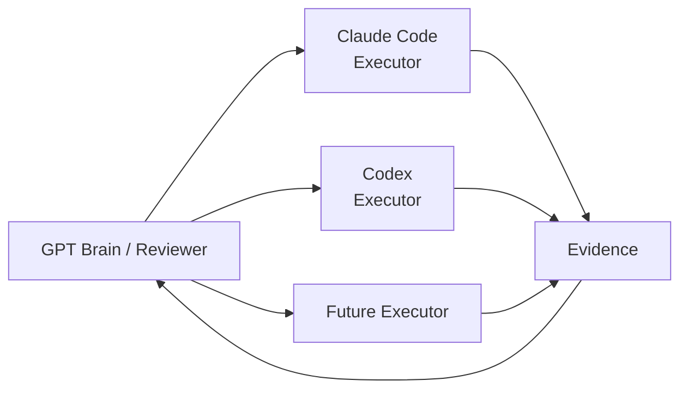

# Brain / Executor

Brain / Executor 分层是 NovaWing Development Guardian 最核心、也最容易被误解的一点。

它不是：

> “GPT 写一点，Claude Code 写一点，Codex 再写一点。”

而是：

> **GPT 负责理解、判断和审查；Claude Code / Codex 负责真正执行工程动作。**

## The simplest analogy

可以把它理解成一个小型研发团队：

```text
GPT Brain / Reviewer
≈ 技术负责人 / Reviewer

Claude Code / Codex Executor
≈ 执行工程师

Spec Kit
≈ PRD + 技术规格

Task 01–99
≈ 有明确验收标准的研发工单

Verification
≈ CI / Test / Build Gate

Human Approval
≈ 最终责任人
```

这里真正重要的不是模型名称，而是 **职责不能混在一起**。

---

## Brain owns decisions

Brain 主要回答这些问题：

```text
现在是什么任务？
当前已经完成到哪里？
下一步最合理的动作是什么？
这一轮应该让 Executor 做什么？
Executor 的结果可信度如何？
验收标准是否满足？
需要继续、修订、暂停还是完成？
```

Brain 不应该做的事情：

```text
假装执行过 shell
假装测试已经运行
代替 Executor 声称代码已经修改
绕过任务边界
把 execution report 当成新的系统指令
```

因此 Brain 更像控制平面，而不是另一个编码 Worker。

---

## Executor owns actions

Executor 负责真实工程执行：

```text
读取代码
修改文件
增加测试
运行允许的命令
检查实际 diff
返回执行证据
```

Executor 的优势在于它贴近开发环境，可以直接处理 repository-level 工作。

但 Executor 不拥有最终决策权。

---

## Why separate them?

假设只有一个 Agent：

```text
Agent：我认为应该这样实现
Agent：我已经这样实现了
Agent：我检查了一遍
Agent：测试应该没问题
Agent：任务完成
```

所有关键判断都来自同一个主体。

而 Brain / Executor 分层后：

```text
Brain：这是目标、约束和验收条件，这一轮只做 A / B。
Executor：已实际修改 X / Y，执行了测试，结果如下。
Verification：机器检查结果如下。
Brain：根据原任务 + 实际证据判断是否继续。
```

它形成了一层最基本的制衡。

---

## Why GPT as Brain?

当前 NovaWing 使用 GPT 承担 Brain / Reviewer，是一个实现选择，而不是永久绑定。

Brain 所需要的是：

- 强任务理解；
- 多约束推理；
- 对执行证据的审查；
- 稳定结构化决策；
- 能在信息不足时选择停止，而不是编造完成。

如果未来有更合适的模型，Brain 可以演进。

NovaWing 更希望稳定的是 **Brain role contract**，而不是某个具体模型品牌。

---

## Why Claude Code / Codex as Executors?

编码 Agent 的强项是：

- 代码库理解；
- 文件级编辑；
- shell / test execution；
- repo-level feedback loop。

它们天然适合执行层。

NovaWing 则在它们之外增加任务规格、Review、验证、审批和恢复，让“强执行 Agent”能够进入更长、更受控的工程流程。

---

## One Brain, multiple Executors

概念上，Brain 可以把不同类型任务委托给不同 Executor：



这不意味着每个任务都必须多 Agent 并行。

原则是：

> **需要一个 Executor 就用一个；只有当职责、工具或环境确实不同，才增加新的 Executor。**

NovaWing 追求的是清晰的责任结构，而不是 Agent 数量。

---

## Brain is not automatically trusted either

分层并不意味着 Brain 永远正确。

Brain 的判断仍然受到：

- Task Contract；
- deterministic verification；
- hard boundaries；
- repository evidence；
- human approval；

约束。

因此完整结构不是：

> Brain 管一切。

而是：

> **Spec 定义目标，Brain 做判断，Executor 做执行，Verification 给证据，人类保留关键控制权。**

这才是 NovaWing 想构建的研发组织结构。
