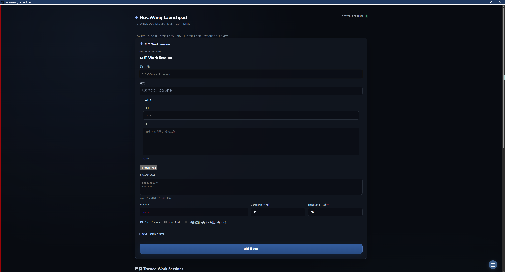
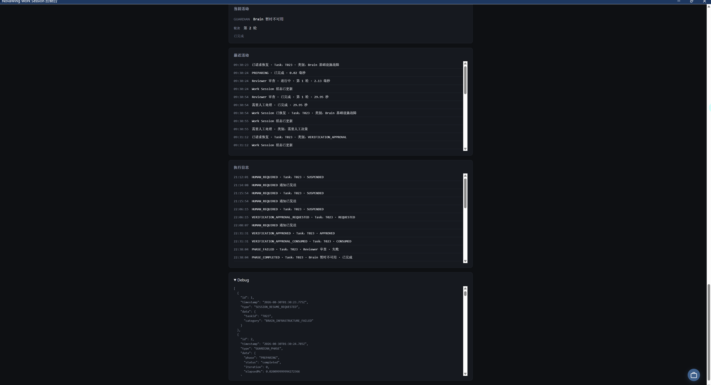

# Demo & Evidence｜真实运行证据

本页集中展示 NovaWing Development Guardian 的真实运行录屏、关键界面与工程证据。

> 核心源码仍保持私有。这里优先展示**真实运行证据**：Work Session、任务边界、执行阶段、日志、降级与恢复，以及 Human-in-the-loop 通知链路。

## 🎬 先看完整运行录屏

如果只看一个内容，就先看这段真实 Work Session。

[](https://weijianjunwjj.github.io/nova-wing-showcase/#demo)

### **▶ [在产品页直接播放完整运行录屏](https://weijianjunwjj.github.io/nova-wing-showcase/#demo)**

> GitHub 对较大的仓库视频文件不提供稳定的网页预览，因此这里不再跳转到 MP4 文件页。上面的入口会直接打开 NovaWing Showcase 的内嵌播放器，体验更快、更稳定。

录屏展示的是 NovaWing 的真实运行过程，而不是概念动画：AI Executor 在受约束的 Work Session 中执行工程任务，Brain / Reviewer 持续判断，执行结果进入 Verification / Final Review；需要人类判断或基础设施异常时，系统可以安全挂起、通知并从 checkpoint 恢复。

**看视频时重点关注：**

- Task、Allowed Paths、Executor 等边界在执行前显式存在；
- Executor 做完不等于任务完成，仍需 Evidence / Verification / Review；
- Work Session 的阶段、轮次、Recent Activity 与 Execution Log 可持续观察；
- Human Required 时系统会保存状态并主动邮件通知开发者；
- Brain transport 异常时保留 checkpoint，恢复后继续，而不是推倒重来。

---

## 一条完整的产品叙事

```text
创建 Work Session
→ 按任务与路径边界执行
→ Brain / Reviewer 持续决策
→ Executor 完成真实工程操作
→ Verification / Final Review
→ 全程可观测
→ 需要人工决策时安全挂起并邮件通知开发者
→ 中断或基础设施异常时从 checkpoint 恢复
```

---

## 1. Launchpad：可信 Work Session 与恢复入口


NovaWing Launchpad 是本地研发控制台入口，用于创建、查看和恢复 Trusted Work Session。

这张图可以直接看到：

- 已持久化的 `Fly-Weave` Work Session；
- `RECOVERABLE` 可恢复状态；
- Reviewer / Executor 的角色配置；
- Auto Commit / Auto Push 等 Git 策略；
- `Email Enabled` 邮件通知状态；
- 中断后继续已有 Work Session，而不是重新从零开始。

它表达的重点是：**NovaWing 管理的是持续存在的研发会话，而不是一次性的 AI 对话。**

---

## 2. 新建 Work Session：先定义边界，再允许 AI 动手



创建 Work Session 时，开发者可以显式配置：

- 项目目录与分支；
- Task ID 与任务内容；
- 允许修改路径；
- Executor；
- Soft Limit / Hard Limit；
- Auto Commit / Auto Push；
- 邮件通知；
- 更高级的 Guardian 规则。

这不是把一句 Prompt 直接扔给编码 Agent，而是先把任务变成一个**有身份、有范围、有时限、有执行策略的工程会话**。

---

## 3. Work Session 主控制台：任务、阶段与 Final Review


Work Session 控制台持续展示：

- 当前项目、分支与已运行时间；
- 当前 Task 的完整上下文；
- 当前 Guardian 阶段；
- 当前轮次；
- Recent Activity；
- Execution Log。

截图中的任务已进入 `Final Review`，说明执行完成之后仍需要独立的 Review，而不是 Executor 自己宣布 `done` 就结束。

NovaWing 希望把复杂研发过程从黑盒变成：**当前在做什么、做到哪一步、为什么还没结束，都能被开发者看见。**

---

## 4. 可观测性：Recent Activity、Execution Log 与 Debug



长链路 Agent 系统如果只有最后一个答案，很难排查真实问题。

NovaWing 因此保留多层级运行信息：

- **Recent Activity**：面向人的阶段变化摘要；
- **Execution Log**：更细粒度的 phase / task 执行记录；
- **Debug Events**：结构化状态事件，用于定位状态迁移与基础设施问题。

重点不是“日志很多”，而是让长时间、多轮的 AI 研发任务具备**可追踪、可回放、可审查**的工程基础。

---

## 5. Brain 暂时不可用：保留 checkpoint，而不是丢掉已有工作


真实系统一定会遇到模型服务、网络或 transport 暂时不可用。

截图中 NovaWing 将问题显式标记为：

```text
BRAIN 暂时不可用
Category: Brain Review · TRANSPORT
Checkpoint: 已保存
```

并提供“修复后恢复”入口。

恢复语义不是“再跑一遍”，而是：

> **保留已经完成并验证过的 Executor 工作，在基础设施恢复后，从可信 checkpoint 继续 Brain Review。**

这也是 Checkpoint / Recovery 被设计成一等能力的原因。

---

# Human-in-the-loop：需要人类判断时，主动邮件通知开发者

NovaWing 的自动化目标不是“无论如何都让 AI 自己决定”。

当任务进入必须由人类判断的关键节点，例如：

- 审批 / 驳回；
- 无法安全自动裁决的下一步；
- 需要开发者明确 continuation input；
- 高风险动作需要确认；
- 任务失败或进入需要人工处理的状态；

NovaWing 会：

```text
识别 Human Required
→ 保存当前 Session / checkpoint
→ 安全挂起自动执行
→ 自动发送邮件通知开发者
→ 开发者回来做明确决策
→ 从原 Work Session 继续
→ 再次进入验证 / Review
```

邮件的作用是**把人的注意力拉回来**，而不是替人授权。

即使开发者通过人工输入允许任务继续，原有的 Goal、Constraints、Acceptance Criteria、Allowed Paths 与 Forbidden Paths 仍然保持有效，不会因为一次人工继续就自动扩大 Executor 权限。

这意味着开发者不需要一直盯着 NovaWing 控制台：

> **系统默认持续自动运行；只有真正需要人类判断时，才主动把人叫回来。**

---

## 这 5 张图共同证明了什么？

它们不是五张孤立 UI，而是一条连续的工程证据链：

| 证据 | 证明的能力 |
| --- | --- |
| Launchpad | Work Session 持久化、角色配置、可恢复、邮件通知 |
| Create Work Session | Task / Path / Time / Git 等执行边界 |
| Final Review | Executor 之后仍有独立 Review 阶段 |
| Logs & Debug | 长任务过程可观测、可追踪、可审查 |
| Degraded & Recovery | 基础设施异常不会直接丢失可信进度 |

因此 NovaWing 当前最核心的价值并不是“又一个 AI Coding UI”，而是尝试把编码 Agent 放进一套：

> **有规格、有任务边界、有角色分工、有证据、有验证、可人工介入、可中断恢复的研发执行闭环。**

---

## 继续深入

如果录屏已经让你理解了产品形态，下一步建议按这个顺序阅读：

**[Brain / Executor](brain-executor.md)** → **[Verification & Recovery](verification-recovery.md)** → **[Technical Review Guide](technical-review-guide.md)**

公开展示版不会披露核心源码、完整 Prompt / 协议和可能影响知识产权规划的关键实现。