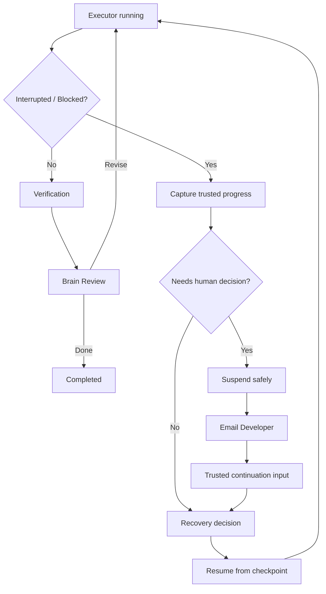

# Verification & Recovery

如果说 Brain / Executor 解决的是“谁来想、谁来做”，那么 Verification / Recovery 解决的是另一个更现实的问题：

> **AI 做完以后，凭什么相信它？做一半断了以后，怎么继续？**

这两个能力决定了一个 AI 编码流程究竟只是 Demo，还是有机会进入长期工程任务。

---

## 1. Evidence before completion

NovaWing 不把 Executor 的自然语言总结直接等同于任务完成。

Executor 可以报告：

```text
改了哪些文件
运行了哪些命令
哪些验证通过 / 失败
还存在哪些 blocker
```

但这些属于 **execution evidence**，而不是最终裁决。

最终是否完成，需要回到：

- 原始 goal；
- constraints；
- acceptance criteria；
- do-not-do；
- allowed / forbidden paths；
- deterministic verification；
- repository evidence；

共同判断。

一句话：

> **AI 可以提交答卷，但不能自己给自己打满分。**

---

## 2. Deterministic verification

大模型适合理解、规划和 Review，但很多工程事实更适合交给确定性工具判断。

典型验证包括：

```text
npm test
npm run typecheck
npm run build
npm run lint
git diff --check
repository-specific deterministic checks
```

这些结果的价值在于：

- 相同输入下更稳定；
- 不依赖模型“感觉应该没问题”；
- 可以留下明确证据；
- 可以作为继续 / 修订 / 完成的重要 gate。

NovaWing 不追求让 LLM 替代 CI，而是让 LLM 和确定性验证各做擅长的事情。

---

## 3. Failure is a state, not an accident

长任务中，失败是正常状态：

```text
测试失败
模型达到执行轮次限制
进程中断
Brain transport 暂时不可用
人工审批等待
外部依赖缺失
当前权限不足
任务信息不完整
```

如果系统只设计“成功路径”，它就很难真正承担复杂研发任务。

因此 NovaWing 把 blocked / human-required / degraded / recovery 等状态当成工作流的一部分，而不是异常之后临时补丁。

---

## 4. Recover instead of restart

最粗暴的恢复策略是：

> “重新开一个 Agent，把整个任务再做一遍。”

这在长任务里会造成几个问题：

- 已完成修改可能被重复实现；
- 新 Agent 重新理解上下文时可能得出不同结论；
- 成本和时间增加；
- 原本可信的中间进度丢失；
- 容易产生重复副作用。

NovaWing 更倾向于：

> **在已有进度经过确认的前提下，从可信 checkpoint 继续。**

恢复后的 Executor 应理解：

```text
这是 continuation，不是新任务
已有修改需要保留
只完成剩余工作
原始边界仍然有效
人工输入不会自动扩大权限
```

---

## 5. Human continuation is not unlimited authorization

人工恢复输入的作用，是解决当前 suspended decision。

它不意味着：

```text
可以忽略原始验收标准
可以修改 forbidden paths
可以执行任意危险命令
可以跳过 repository verification
```

也就是说：

> **“继续”不等于“你现在什么都可以做”。**

这是 Human-in-the-loop 容易被忽略但很重要的一点。

### 让人回来，但不让人一直守着

当 suspended decision 必须由人解决时，NovaWing 可以先保存 Session / checkpoint，再自动邮件通知开发者：

```text
Human Required
→ Persist trusted state
→ Suspend automation
→ Email developer
→ Explicit human input
→ Resume existing session
```

这里必须区分两个概念：

- **Notification**：把开发者的注意力拉回来；
- **Authorization / Continuation**：开发者实际提交的可信决定。

收到邮件本身不会改变任务权限，也不会使 Executor 获得更大的修改范围。

---

## 6. Recovery loop



---

## 7. A real degraded-state example

公开 Showcase 中已经展示一个真实界面：Brain transport 暂时不可用时，Work Session 明确进入 degraded 状态，并显示 checkpoint 已保存与“修复后恢复”入口。

这类场景要表达的不是“系统不会出错”，而是：

> **出错以后，已有可信工作不会因为控制层短暂不可用而被无条件丢弃。**

真实截图见 [`demo.md`](demo.md)。

---

## 8. Why this matters

短 Prompt 的核心指标通常是“第一次回答好不好”。

长链路研发任务的指标则不同：

> **它能不能在第 3、5、10 轮仍然记得目标，接受验证，处理失败，在真正需要时找到人，并安全地继续。**

因此 NovaWing 更关注的不是单次生成质量，而是：

**Reliability · Control · Evidence · Continuity · Human Attention Routing**
