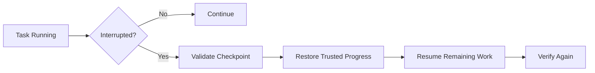

# Workflow

NovaWing 的研发流程可以概括成一条连续链路：

> **Specification → Task → Decision → Execution → Evidence → Verification → Review → Approval / Recovery → Done**

## 1. Specification

研发任务首先进入规格层。

通过 Spec Kit 将自然语言需求进一步明确为：

- Goal
- Constraints
- Acceptance Criteria
- Do Not Do
- Scope / Allowed Paths
- Forbidden Paths
- Verification Expectations

目标是减少“需求模糊 → Agent 自己补全假设 → 最后偏离目标”的情况。

---

## 2. Task 01–99

规格不会直接作为一个超长 Prompt 丢给编码 Agent。

NovaWing 使用约定的 `Task 01–99` 任务体系，把复杂研发目标拆成一组连续、独立可验收的研发单元。

例如：

```text
Task 01  建立基础契约
Task 02  完成领域模型
Task 03  接入执行适配
...
Task 27  完成某个闭环能力
...
Task 99  最终收口 / 发布准备
```

这里的编号只是稳定索引，真正重要的是每个 Task 都有自己的目标、边界和验收条件。

因此一个任务可以明确回答：

> “这一轮到底允许改什么？必须做到什么？什么情况算失败？”

---

## 3. Brain decision

Task 进入 GPT Brain / Reviewer 后，Brain 首先做的不是写代码，而是判断：

- 当前任务是否已经具备执行条件？
- 是否存在 blocker？
- 下一步应该交给哪个 Executor？
- Executor 应该完成哪些有限动作？
- 哪些边界不能突破？
- 本轮完成后需要哪些验证证据？

Brain 输出的是 **delegation / decision**，而不是伪造的执行结果。

---

## 4. Executor execution

Claude Code / Codex 收到任务后执行真实工程工作。

执行层只应在任务允许范围内完成必要动作，并将结果整理成 execution evidence，例如：

```text
Changed files
Commands run
Verification results
Blockers
Incomplete reason
```

一个关键区别：

> **Execution Report ≠ Completion Certificate**

Executor 可以说“我完成了”，但 Brain 不应该因此直接判定完成。

---

## 5. Deterministic verification

系统尽可能使用可重复执行的工程检查验证结果。

例如：

```bash
npm test
npm run typecheck
npm run lint
npm run build
git diff --check
```

不同宿主项目可以拥有自己的 deterministic verification。

NovaWing 希望把 AI 研发从：

> “模型觉得代码应该没问题”

变成：

> “模型给出实现，工程系统用确定性证据继续判断。”

---

## 6. Review loop

Brain 综合以下信息进行 Review：

- 原始 Task Contract
- 当前 iteration
- Executor 的 execution evidence
- deterministic verification
- 已有 checkpoint / progress
- 必要的人类 continuation input

然后做有限集合中的下一步裁决，例如：

```text
proceed  → 进入下一轮执行
revise   → 针对问题修订
blocked  → 无法安全自动继续
human    → 请求人工决策
recover  → 从可信 checkpoint 延续
complete → 验收完成
```

真实内部 verdict / state 可能随版本演进，本页描述的是公开层面的工作模型。

---

## 7. Human approval

不是所有工程决策都应该自动化。

当遇到需要用户明确授权的情况，工作会话应安全挂起，并把必要信息交给人类，而不是通过扩大 Agent 权限“想办法继续”。

人工输入用于解决当前 suspended decision，但不会自动改变原任务的：

- Goal
- Constraints
- Acceptance Criteria
- Allowed Scope
- Forbidden Scope

也就是说：

> **“允许继续”不等于“取消所有边界”。**

---

## 8. Checkpoint / Recovery

长任务一定会遇到中断。

NovaWing 把中断视作正常工程事件，而不是异常的“聊天结束”。

高层恢复逻辑：



恢复需要保证：

- 不要求 Executor 丢弃已经有效的修改；
- 不从零重复整个任务；
- 不把未经验证的状态当成 checkpoint；
- 不因为恢复而扩大权限；
- 对可能产生副作用的动作保持谨慎。

---

## 9. Completion

一个 Task 的完成条件不是“Executor 没有更多内容要写”，而是：

1. Acceptance Criteria 被满足；
2. 必要 deterministic verification 通过；
3. 没有未解决 blocker；
4. 修改没有突破硬边界；
5. Brain / Reviewer 能基于证据给出完成裁决。

然后系统才进入下一个 Task，直到整个规格对应的任务链闭环。

---

## Mental model

可以把 NovaWing 想成一个小型 AI 研发团队：

| 现实研发团队 | NovaWing |
| --- | --- |
| PRD / 技术规格 | Spec Kit |
| Jira / 研发工单 | Task 01–99 |
| 技术负责人 / Reviewer | GPT Brain |
| 开发工程师 | Claude Code / Codex Executor |
| CI / Tests | Verification |
| 审批人 | Human Approval |
| Git / Session State | Checkpoint / Recovery |

区别在于，这些角色被组织进了一条可编排、可审查的 AI-native 工作流中。
